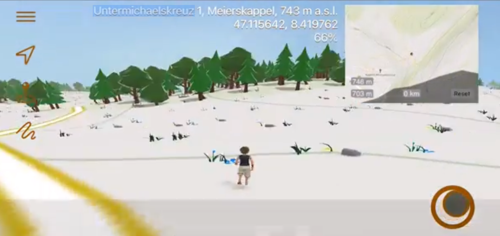

# ReExplore

ReExplore is an interactive 3D map that lets you experience the world at ground level, rather than just viewing it from above. You can walk through the map, upload GPX tracks, or create and download your own custom routes.

- [Mac edition](https://youtu.be/Xf89Nbpqwkw)
- [iOS edition](https://youtu.be/cj-E_iCTDQ4)

## Info

Uses cocoapods package manager. Run `pod install`. Note, CoreGPX does not work anymore and must be replaced. The mapbox url did also change. Coordinates don't use z/x/y labels anymore, but simply /z/x/y.