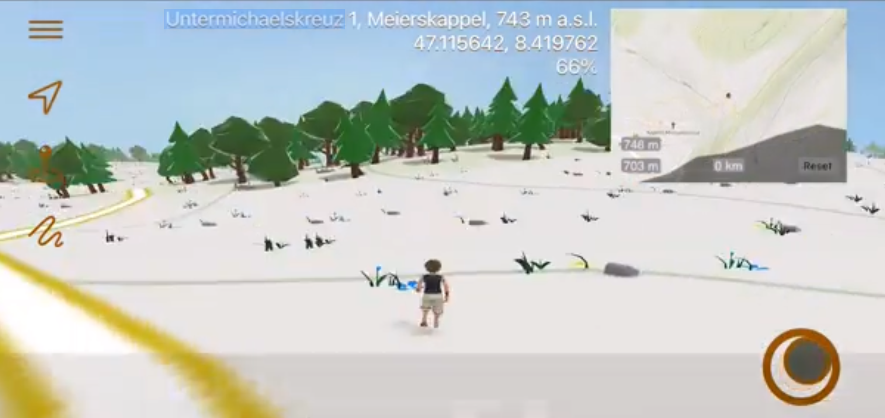

# ReExplore

ReExplore is an interactive 3D map that lets you experience the world at ground level, rather than just viewing it from above. You can walk through the map, upload GPX tracks, or create and download your own custom routes.

- [Mac edition](https://youtu.be/Xf89Nbpqwkw)
- [iOS edition](https://youtu.be/cj-E_iCTDQ4)

